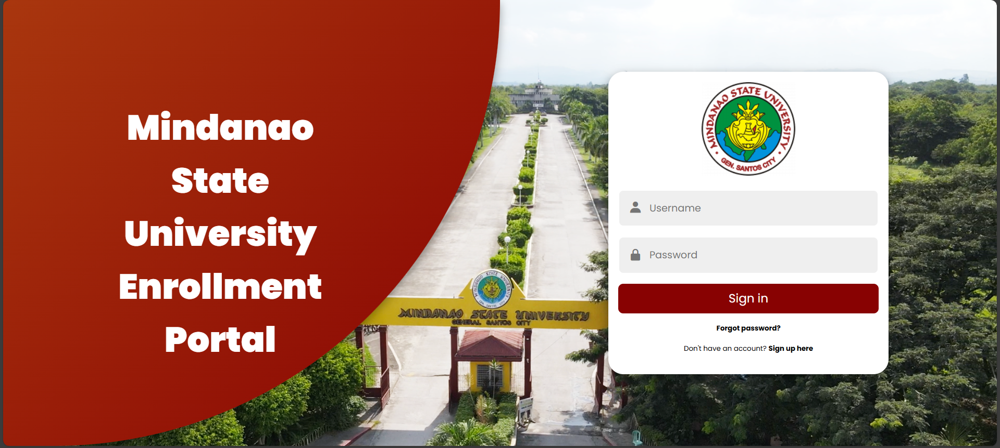
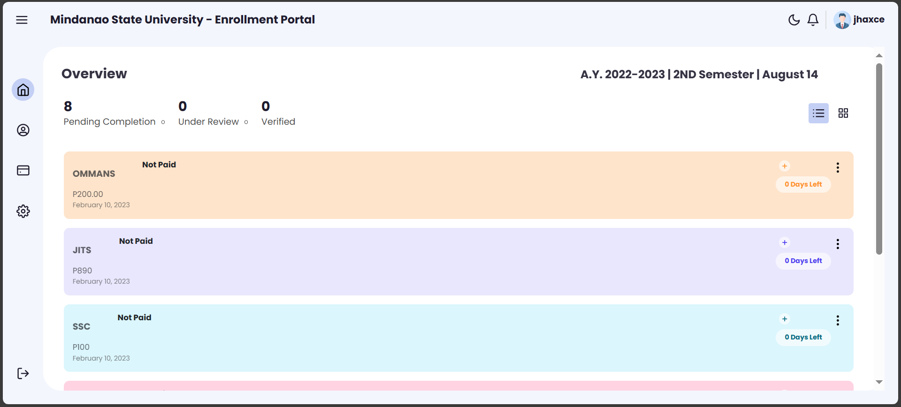
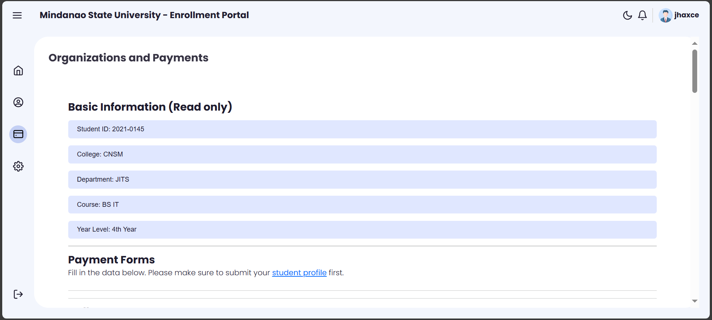

# 🎓 Enrollment Portal – Academic Project

## 📚 Overview
The **Enrollment Portal** is a web-based system designed as part of an academic requirement for Mindanao State University.  
It simulates a secure platform where students can sign up, log in, view dashboards, manage profiles, process payments, and adjust settings.  
**Note:** This project is for **academic purposes only** and is not officially implemented.

## ✨ Features
- **User Authentication**
  - Sign up, sign in, and session-based access (`auth_session.php`).
- **Dashboard**
  - Overview of enrollment status and activities.
  - CRUD operations for dashboard content.
- **Profile Management**
  - Create, update, and delete student profile information.
- **Payments Module**
  - Record and manage payment transactions.
- **Settings**
  - Update system and user preferences.
- **Admin Access**
  - Separate admin interface (`admin/index.php`).
- **Responsive UI**
  - CSS styling and JavaScript interactivity.
  - Dark mode (`dark.js`).

## 🛠️ Technologies Used
- **Frontend:** HTML5, CSS3, JavaScript (jQuery)
- **Backend:** PHP (Procedural)
- **Database:** MySQL / MariaDB (`draft/enrollment.sql`)
- **Assets:** Bootstrap-based custom CSS, images, icons

## 📂 Project Structure
```
├── README.md                # Project documentation
├── admin/                   # Admin interface
│   └── index.php
├── dashboard/               # Main user dashboard
│   ├── auth_session.php
│   ├── css/                 # Stylesheets
│   ├── js/                  # JavaScript files
│   ├── img/                 # Image assets
│   ├── dashboard*.php       # Dashboard CRUD
│   ├── payments*.php        # Payment CRUD
│   ├── profile*.php         # Profile CRUD
│   ├── settings*.php        # Settings CRUD
│   └── signout.php
├── db.php                   # Database connection
├── draft/                   # HTML prototypes & SQL schema
│   ├── enrollment.sql
│   ├── *.html
├── index.html               # Landing page
├── signin.php               # Login page
├── signup.php               # Registration page
├── script.js                # General JS
├── style.css                # General styles
└── assets/*.png             # Logo and images
```

## ⚙️ Installation & Setup
1. **Clone Repository**
   ```bash
   git clone https://github.com/username/enrollment-portal.git
   ```
2. **Database Setup**
   - Create a database in MySQL/MariaDB.
   - Import `draft/enrollment.sql`.
   - Update `db.php` with your database credentials.
3. **Run Locally**
   - Place files in your web server directory (e.g., `htdocs` for XAMPP).
   - Start Apache and MySQL.
   - Access `http://localhost/enrollment-portal`.

## 📸 Screenshots
### Sign In


### Sign Up


### Dashboard


### Profile


### Payment


## 📜 Academic Disclaimer
This system is a **prototype developed for educational purposes** at Mindanao State University.  
It is **not an official enrollment platform** and should not be used for actual student registrations.

## 👥 Contributors
- **Jhaxce** – Lead Developer  